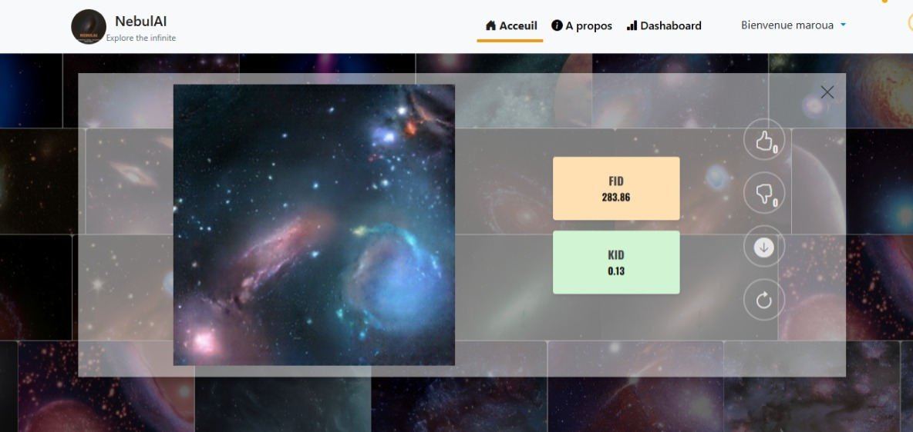

# 🌌 NebulAI - Synthetic Galaxy Image Generator

NebulAI is a full-stack web application built with Django (backend) and React (frontend) that allows users to generate synthetic galaxy images using a combined K-Means and Conditional GAN (cGAN) approach. This project provides an intuitive interface for exploring AI-generated astronomical content.

---

##  Features

* Secure authentication (JWT) with **Login** / **Signup** pages
* Galaxy image generation powered by **K-Means + cGAN**
* Smooth user interface built with React
* Django REST API for backend logic
* On-demand download of generated images
* Image voting (like,dislike)

---

## Screenshots

### Login Page


---

### Signup Page


---

### Home Page (Image Generation)

> Users can generate synthetic galaxies without necessarly signing in but only vote when use signs in.


**Image Generation & Evaluation**

- User Interaction

    - After clicking the **Generate** button, a synthetic galaxy image is produced using the CGAN+KMeans model and rendered on the screen. Users can then:

        - **Like** or **Dislike** the generated image
        - **Download** the image manually
        - **Re-generate** a new variation if unsatisfied with the current one

- Model Evaluation – FID & KID Metrics

    To assess the quality of generated images, two evaluation metrics are computed:

    - **FID**: *Fréchet Inception Distance*  
    - **KID**: *Kernel Inception Distance*

    Metric Interpretation:

    - A **KID score close to 0** indicates that the generated images are perceptually similar to real images — this is the desired outcome.
    - The **FID score is relatively high**, which is expected given the small and limited training dataset.
    - As such, **KID is a more trustworthy indicator** of model performance in this specific case.

**Further Reading**:  
[Kernel Inception Distance (KID) – Original Paper by Bińkowski et al. (2018)](https://arxiv.org/abs/1801.01401)


---

### Dashboard (Admin Only)

The dashboard provides a quick overview of user interactions and image generation statistics and it is displayed only for authenticated users with admin privileges.:

* **Total Generated Images**: Displays the count of all images generated.
* **Liked & Disliked Images**: Shows how many images have been liked or disliked, helping track user preferences.
* **Generation History**: A log of previously generated images with timestamps. 


---

## ML Model - KMeans + cGAN

The model pipeline includes:

1. Clustering latent space features using K-Means.
2. Conditioning a cGAN on cluster labels.
3. Generating high-resolution galaxy images based on user-selected conditions.

---

## Tech Stack

| Frontend        | Backend              | ML / Deep Learning   |
| --------------- | -------------------- | -------------------- |
| ReactJS         | Django + DRF         | TensorFlow |
| Bootstrap / CSS | SimpleJWT (JWT Auth) | cGAN, K-Means        |

---
## Video Demo


[cgan (1).webm](https://github.com/user-attachments/assets/eac40c76-03df-4a91-a601-cc41e12d6b88)

---

##  Installation (Development)

### Backend (Django)

```bash
cd backend
pip install -r requirements.txt
python manage.py migrate
python manage.py runserver
```

### Frontend (React)

```bash
cd frontend
npm install
npm run dev
```

---

## Authentication

JWT (via SimpleJWT) is used to:

* Create access and refresh tokens
* Protect private routes (dashboard, generation)
* Assign admin roles for privileged access

---

## Authors

* OURAHMA Maroua
* Linkedin : [link](https://www.linkedin.com/in/maroua-ourahma/)
* Github : [link](https://github.com/ourahma)
* Email : [Send me an email](mailto:marouaourahma@gmail.com)

---

## License

This project is open-source under the MIT License.
